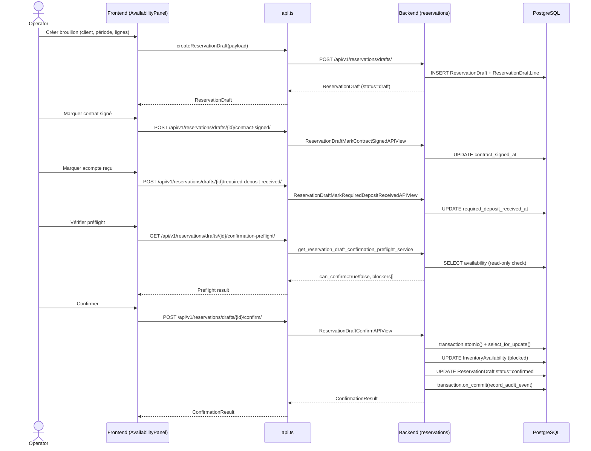
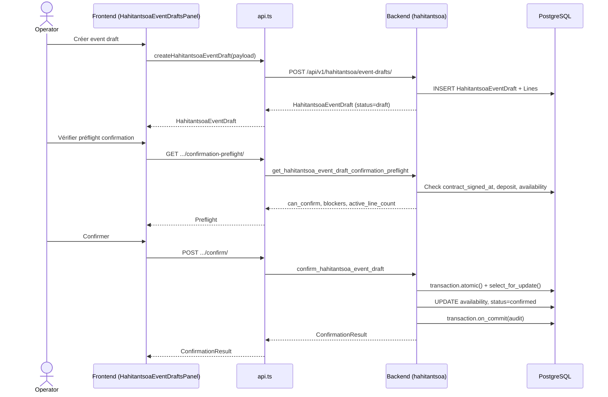
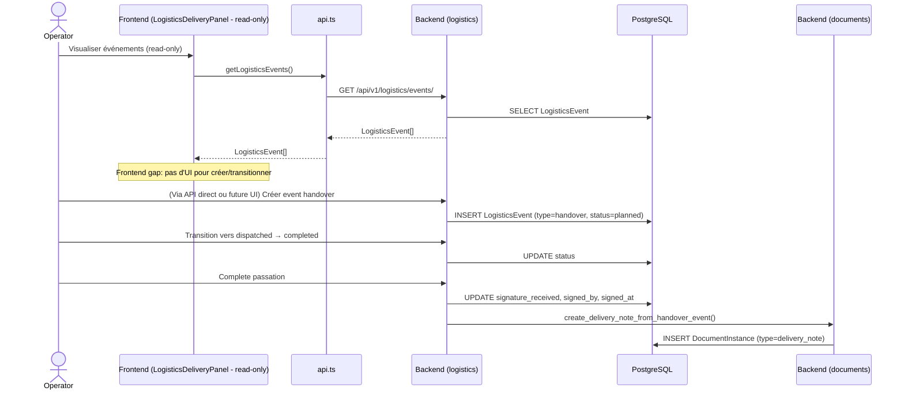
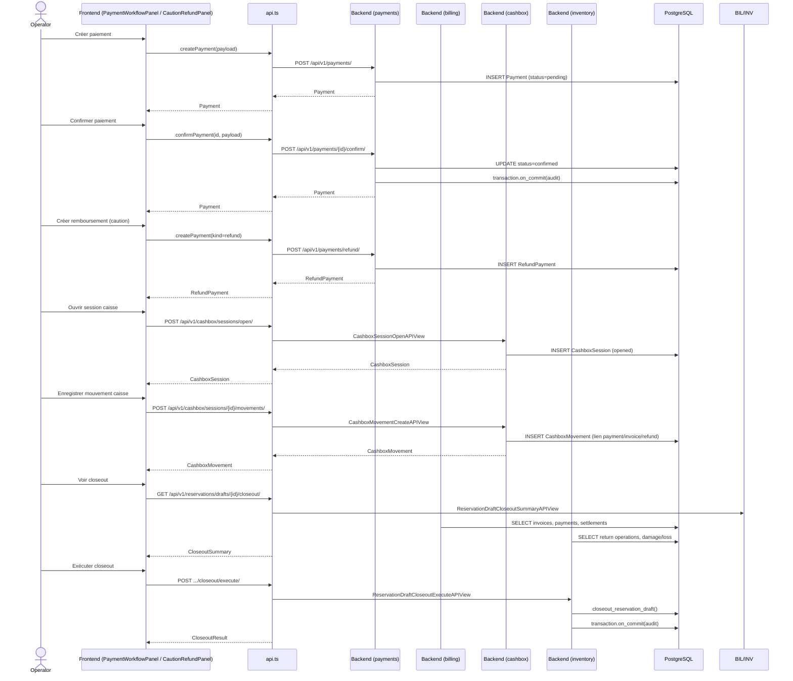
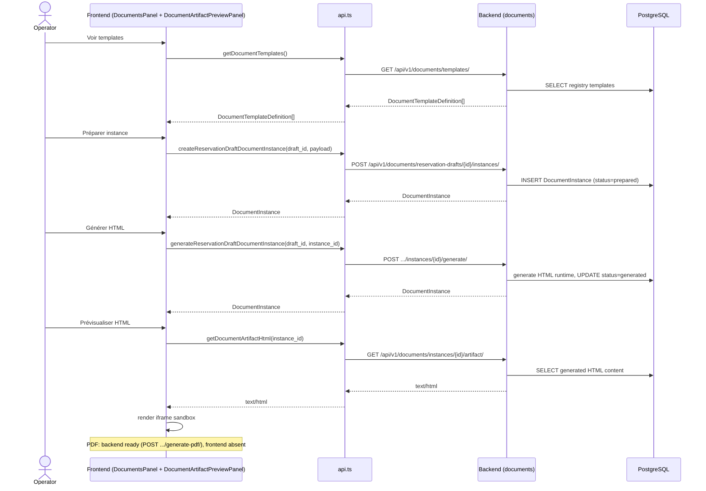

# API_AND_DATA_FLOW_MAP.md — Flux API et données

> **Version:** F176A — 2026-06-24
> **Référence:** Document A/B, backend live, frontend live

---

## 1. Vue d'ensemble — Frontend Page → API → Backend

```
┌─────────────────────────────────────────────────────────────────────────────┐
│                              Frontend React                                  │
│  (Hash-based scope switching, React 19, TypeScript strict, Vite)            │
└─────────────────────────────────────────────────────────────────────────────┘
                                      │
                                      ▼ fetch (credentials: include, CSRF)
┌─────────────────────────────────────────────────────────────────────────────┐
│                              Django REST Framework                           │
│  (DRF + drf-spectacular, OpenAPI auto-generated, session auth)              │
└─────────────────────────────────────────────────────────────────────────────┘
                                      │
                    ┌─────────────────┼─────────────────┐
                    ▼                 ▼                 ▼
              ┌─────────┐      ┌──────────┐      ┌────────────┐
              │ Services │      │ Selectors │      │  Modèles   │
              │ (writes) │      │ (reads)  │      │ (données)  │
              └─────────┘      └──────────┘      └────────────┘
                    │                 │                 │
                    ▼                 ▼                 ▼
              ┌─────────────────────────────────────────────────────┐
              │               PostgreSQL 17 + Redis 8                  │
              │   (transaction.atomic(), select_for_update)         │
              └─────────────────────────────────────────────────────┘
```

---

## 2. Mapping Frontend Page → API Endpoint → Backend

### 2.1 Dashboard

| Frontend | API Function | Endpoint | Backend View | Backend Service/Model |
|---|---|---|---|---|
| `DashboardPanel` | `getInventoryItems` | `GET /api/v1/inventory/items/` | `InventoryItemListAPIView` | `InventoryItem` |
| `DashboardPanel` | `getReservationDrafts` | `GET /api/v1/reservations/drafts/` | `ReservationDraftListCreateAPIView` | `ReservationDraft` |
| `DashboardPanel` | `getPayments` | `GET /api/v1/payments/` | `PaymentListCreateAPIView` | `Payment` |
| `DashboardPanel` | `getHahitantsoaEventDrafts` | `GET /api/v1/hahitantsoa/event-drafts/` | `HahitantsoaEventDraftListCreateAPIView` | `HahitantsoaEventDraft` |

### 2.2 Titan — Disponibilité et brouillons

| Frontend | API Function | Endpoint | Backend View | Backend Service/Model |
|---|---|---|---|---|
| `AvailabilityPanel` | `getReservationAvailabilitySummary` | `GET /api/v1/reservations/availability-summary/` | `ReservationAvailabilitySummaryAPIView` | `get_reservation_availability_summary_service` |
| `AvailabilityPanel` | `getReservationAvailableItemPreviews` | `GET /api/v1/reservations/available-item-previews/` | `ReservationAvailableItemPreviewsAPIView` | `get_reservation_available_item_previews_service` |
| `AvailabilityPanel` | `getReservationItemAvailabilityPreview` | `GET /api/v1/reservations/items/{id}/availability-preview/` | `ReservationItemAvailabilityPreviewAPIView` | `preview_reservation_item_service` |
| `AvailabilityPanel` | `getCustomers` | `GET /api/v1/customers/` | `CustomerListAPIView` | `Customer` |
| `AvailabilityPanel` | `getReservationDrafts` | `GET /api/v1/reservations/drafts/` | `ReservationDraftListCreateAPIView` | `ReservationDraft` |
| `AvailabilityPanel` | `getReservationDraft` | `GET /api/v1/reservations/drafts/{id}/` | `ReservationDraftRetrieveAPIView` | `ReservationDraft` |
| `AvailabilityPanel` | `createReservationDraft` | `POST /api/v1/reservations/drafts/` | `ReservationDraftListCreateAPIView` | `ReservationDraft` + `ReservationDraftLine` |
| `AvailabilityPanel` | `updateReservationDraft` | `PATCH /api/v1/reservations/drafts/{id}/` | `ReservationDraftRetrieveAPIView` | `ReservationDraft` |

### 2.3 Titan — Mouvements de stock

| Frontend | API Function | Endpoint | Backend View | Backend Service/Model |
|---|---|---|---|---|
| `TitanStockMovementPanel` | `getStockMovements` | `GET /api/v1/inventory/stock-movements/` | `InventoryStockMovementListCreateAPIView` | `InventoryStockMovement` |
| `TitanStockMovementPanel` | `createStockMovement` | `POST /api/v1/inventory/stock-movements/` | `InventoryStockMovementListCreateAPIView` | `create_inventory_stock_movement` |

### 2.4 Hahitantsoa — Découverte

| Frontend | API Function | Endpoint | Backend View | Backend Service/Model |
|---|---|---|---|---|
| `HahitantsoaDiscoveryPanel` | `getHahitantsoaDiscoveryItems` | `GET /api/v1/hahitantsoa/discovery-items/` | `HahitantsoaDiscoveryItemsAPIView` | `list_hahitantsoa_discovery_items` |

### 2.5 Hahitantsoa — Brouillons événement

| Frontend | API Function | Endpoint | Backend View | Backend Service/Model |
|---|---|---|---|---|
| `HahitantsoaEventDraftsPanel` | `getHahitantsoaEventDrafts` | `GET /api/v1/hahitantsoa/event-drafts/` | `HahitantsoaEventDraftListCreateAPIView` | `HahitantsoaEventDraft` |
| `HahitantsoaEventDraftsPanel` | `createHahitantsoaEventDraft` | `POST /api/v1/hahitantsoa/event-drafts/` | `HahitantsoaEventDraftListCreateAPIView` | `HahitantsoaEventDraft` + `HahitantsoaEventDraftLine` |
| `HahitantsoaEventDraftsPanel` | `updateHahitantsoaEventDraft` | `PATCH /api/v1/hahitantsoa/event-drafts/{id}/` | `HahitantsoaEventDraftRetrieveUpdateAPIView` | `HahitantsoaEventDraft` |
| `HahitantsoaEventDraftsPanel` | `deleteHahitantsoaEventDraft` | `DELETE /api/v1/hahitantsoa/event-drafts/{id}/` | `HahitantsoaEventDraftRetrieveUpdateAPIView` | `HahitantsoaEventDraft` |
| `HahitantsoaEventDraftsPanel` | `getHahitantsoaEventDraftAvailabilityPreview` | `GET /api/v1/hahitantsoa/event-drafts/{id}/availability-preview/` | `HahitantsoaEventDraftAvailabilityPreviewAPIView` | `get_hahitantsoa_event_draft_availability_preview` |
| `HahitantsoaEventDraftsPanel` | `getHahitantsoaEventDraftConfirmationPreflight` | `GET /api/v1/hahitantsoa/event-drafts/{id}/confirmation-preflight/` | `HahitantsoaEventDraftConfirmationPreflightAPIView` | `get_hahitantsoa_event_draft_confirmation_preflight` |
| `HahitantsoaEventDraftsPanel` | `confirmHahitantsoaEventDraft` | `POST /api/v1/hahitantsoa/event-drafts/{id}/confirm/` | `HahitantsoaEventDraftConfirmAPIView` | `confirm_hahitantsoa_event_draft` |
| `HahitantsoaEventDraftsPanel` | `getHahitantsoaEventDraftAmendmentPreflight` | `GET /api/v1/hahitantsoa/event-drafts/{id}/amendment-preflight/` | `HahitantsoaEventDraftAmendmentPreflightAPIView` | `get_hahitantsoa_event_draft_amendment_preflight` |

### 2.6 Hahitantsoa — Avenant

| Frontend | API Function | Endpoint | Backend View | Backend Service/Model |
|---|---|---|---|---|
| `HahitantsoaEventDraftsPanel` | `getHahitantsoaEventDraftAmendmentRequests` | `GET /api/v1/hahitantsoa/event-drafts/{id}/amendment-requests/` | `HahitantsoaEventDraftAmendmentRequestListCreateAPIView` | `HahitantsoaEventDraftAmendmentRequest` |
| `HahitantsoaEventDraftsPanel` | `createHahitantsoaEventDraftAmendmentRequest` | `POST .../amendment-requests/` | `HahitantsoaEventDraftAmendmentRequestListCreateAPIView` | `create_hahitantsoa_event_draft_amendment_request` |
| `HahitantsoaEventDraftsPanel` | `updateHahitantsoaEventDraftAmendmentRequest` | `PATCH .../amendment-requests/{id}/` | `HahitantsoaEventDraftAmendmentRequestRetrieveUpdateAPIView` | `HahitantsoaEventDraftAmendmentRequest` |
| `HahitantsoaEventDraftsPanel` | `getHahitantsoaEventDraftAmendmentRequestLines` | `GET .../amendment-requests/{id}/lines/` | `HahitantsoaEventDraftAmendmentRequestLineListCreateAPIView` | `HahitantsoaEventDraftAmendmentRequestLine` |
| `HahitantsoaEventDraftsPanel` | `createHahitantsoaEventDraftAmendmentRequestLine` | `POST .../lines/` | `HahitantsoaEventDraftAmendmentRequestLineListCreateAPIView` | `HahitantsoaEventDraftAmendmentRequestLine` |
| `HahitantsoaEventDraftsPanel` | `getHahitantsoaEventDraftAmendmentRequestAvailabilityPreflight` | `GET .../amendment-requests/{id}/availability-preflight/` | `HahitantsoaEventDraftAmendmentRequestAvailabilityPreflightAPIView` | Selectors availability |

### 2.7 Clients

| Frontend | API Function | Endpoint | Backend View | Backend Service/Model |
|---|---|---|---|---|
| `CustomerPanel` | `getCustomers` | `GET /api/v1/customers/` | `CustomerListAPIView` | `Customer` |
| `CustomerPanel` | `getCustomer` | `GET /api/v1/customers/{id}/` | `CustomerRetrieveAPIView` | `Customer` |
| `CustomerPanel` | `createCustomer` | `POST /api/v1/customers/create/` | `CustomerCreateAPIView` | `Customer` |
| `CustomerPanel` | `updateCustomer` | `POST /api/v1/customers/{id}/update/` | `CustomerUpdateAPIView` | `Customer` |
| `CustomerPanel` | `deleteCustomer` | `POST /api/v1/customers/{id}/delete/` | `CustomerSoftDeleteAPIView` | `Customer` (soft-delete) |

### 2.8 Documents

| Frontend | API Function | Endpoint | Backend View | Backend Service/Model |
|---|---|---|---|---|
| `TitanDocumentsPanel`, `HahitantsoaDocumentsPanel` | `getDocumentTemplates` | `GET /api/v1/documents/templates/` | `DocumentTemplateRegistryAPIView` | `registry.py` |
| `TitanDocumentsPanel` | `getReservationDraftDocumentInstances` | `GET /api/v1/documents/reservation-drafts/{id}/instances/` | `ReservationDraftDocumentInstanceListCreateAPIView` | `list_document_instances_for_reservation_draft` |
| `TitanDocumentsPanel` | `createReservationDraftDocumentInstance` | `POST .../instances/` | `ReservationDraftDocumentInstanceListCreateAPIView` | `create_document_instance_from_reservation_draft` |
| `TitanDocumentsPanel` | `generateReservationDraftDocumentInstance` | `POST .../instances/{id}/generate/` | `ReservationDraftDocumentInstanceGenerateAPIView` | `generate_reservation_draft_document_instance_html` |
| `DocumentArtifactPreviewPanel` | `getDocumentArtifactHtml` | `GET /api/v1/documents/instances/{id}/artifact/` | `DocumentInstancePrivateArtifactAPIView` | Contenu HTML généré |
| `HahitantsoaDocumentsPanel` | `getHahitantsoaEventDraftDocumentInstances` | `GET /api/v1/hahitantsoa/event-drafts/{id}/documents/` | `HahitantsoaEventDraftDocumentInstanceListCreateAPIView` | `list_document_instances_for_hahitantsoa_event_draft` |
| `HahitantsoaDocumentsPanel` | `createHahitantsoaEventDraftDocumentInstance` | `POST .../documents/` | `HahitantsoaEventDraftDocumentInstanceListCreateAPIView` | `create_document_instance_from_hahitantsoa_event_draft` |
| `HahitantsoaDocumentsPanel` | `generateHahitantsoaEventDraftDocumentInstance` | `POST .../documents/{id}/generate/` | `HahitantsoaEventDraftDocumentInstanceGenerateAPIView` | `generate_hahitantsoa_event_draft_document_instance_html` |

### 2.9 Paiements

| Frontend | API Function | Endpoint | Backend View | Backend Service/Model |
|---|---|---|---|---|
| `PaymentWorkflowPanel`, `CautionRefundPanel` | `getPayments` | `GET /api/v1/payments/` | `PaymentListCreateAPIView` | `Payment` |
| `PaymentWorkflowPanel` | `createPayment` | `POST /api/v1/payments/` | `PaymentListCreateAPIView` | `create_payment` |
| `PaymentWorkflowPanel` | `confirmPayment` | `POST /api/v1/payments/{id}/confirm/` | `PaymentConfirmAPIView` | `confirm_payment` |
| `CautionRefundPanel` | `createPayment` (kind=caution) | `POST /api/v1/payments/` | `PaymentListCreateAPIView` | `create_payment` |

### 2.10 Facturation

| Frontend | API Function | Endpoint | Backend View | Backend Service/Model |
|---|---|---|---|---|
| `BillingInvoicePanel` | `getBillingInvoices` | `GET /api/v1/billing/invoices/` | `BillingInvoiceListAPIView` | `BillingInvoice` |

**Note :** Les endpoints `settle`, `cancel`, `installments`, `credit-notes`, `refund-obligations` existent backend mais ne sont pas encore appelés par le frontend.

### 2.11 Logistique

| Frontend | API Function | Endpoint | Backend View | Backend Service/Model |
|---|---|---|---|---|
| `LogisticsDeliveryPanel` | `getLogisticsEvents` | `GET /api/v1/logistics/events/` | `LogisticsEventListAPIView` | `active_logistics_events` |

**Note :** Les endpoints `create`, `update`, `transition`, `lines/add`, `lines/remove`, `complete-passation` existent backend mais ne sont pas encore appelés par le frontend.

### 2.12 Retours / Casse / Perte

| Frontend | API Function | Endpoint | Backend View | Backend Service/Model |
|---|---|---|---|---|
| `ReturnsHandlingPanel` | `getReturnOperations` | `GET /api/v1/inventory/return-operations/` | `InventoryReturnOperationListCreateAPIView` | `InventoryReturnOperation` |
| `BreakageLossPanel` | `getDamageLossSettlements` | `GET /api/v1/inventory/damage-loss-settlements/` | `InventoryDamageLossSettlementListCreateAPIView` | `InventoryDamageLossSettlement` |

### 2.13 Mouvements stock (ledger)

| Frontend | API Function | Endpoint | Backend View | Backend Service/Model |
|---|---|---|---|---|
| `StockMovementLedgerPanel` | `getStockMovements` | `GET /api/v1/inventory/stock-movements/` | `InventoryStockMovementListCreateAPIView` | `InventoryStockMovement` |

### 2.14 Identity

| Frontend | API Function | Endpoint | Backend View | Backend Service/Model |
|---|---|---|---|---|
| `IdentityPanel` | `getRoles` | `GET /api/v1/identity/roles/` | `ApplicationRoleListCreateAPIView` | `ApplicationRole` |
| `IdentityPanel` | `getRoleAssignments` | `GET /api/v1/identity/assignments/` | `UserRoleAssignmentListAPIView` | `UserRoleAssignment` |

---

## 3. Workflows métier clés

### 3.1 Workflow brouillon → confirmation (Titan)



**Frontend gap :** Le marquage contrat signé, acompte reçu, et la confirmation ne sont pas encore exposés dans le UI Titan (seulement backend). Hahitantsoa a le préflight + confirm UI.

### 3.2 Workflow brouillon → confirmation (Hahitantsoa)



### 3.3 Workflow logistique — Passation



### 3.4 Workflow facturation — Paiement → Caisse → Clôture



**Frontend gaps :** Pas de UI pour cashbox (sessions, mouvements), pas de UI pour billing settle/cancel/installments/credit notes, pas de UI pour closeout execute.

### 3.5 Workflow documents — Template → Instance → Génération



---

## 4. Dépendances et frontières hard-stop

### Frontières métier incontournables

| Frontière | Règle | Conséquence si violée |
|---|---|---|
| Titan scope | Uniquement `material`, `article`, `material_pack` | Rejet API + interdiction frontend |
| Hahitantsoa scope | Peut inclure `venue`, `local`, `room`, `hall`, `service` | Accepté dans Hahitantsoa, jamais dans Titan |
| Confirmation | Requiert contrat signé + acompte + revalidation dispo | Échec préflight, blocage transactionnel |
| Proforma ≠ confirmation | Un proforma est une estimation | Ne jamais traiter proforma comme confirmation |
| Contrat immuable | Modifications uniquement via avenant | Risque d'intégrité juridique |
| Documents sensibles | CIN, NIF, STAT, RCS = privés | Pas d'URL publique permanente |

### Frontières agent

| Frontière | Règle |
|---|---|
| Backend gel | Pas de nouvelle feature backend sans autorisation |
| Frontend/backend | Frontend peut appeler endpoints existants ; ne pas inventer endpoints |
| One worktree | Un agent = une branche = un scope |
| Pas de docs/app mélangés | F176A ne touche pas backend/frontend/tests |

---
*Fin du flux API et données*
