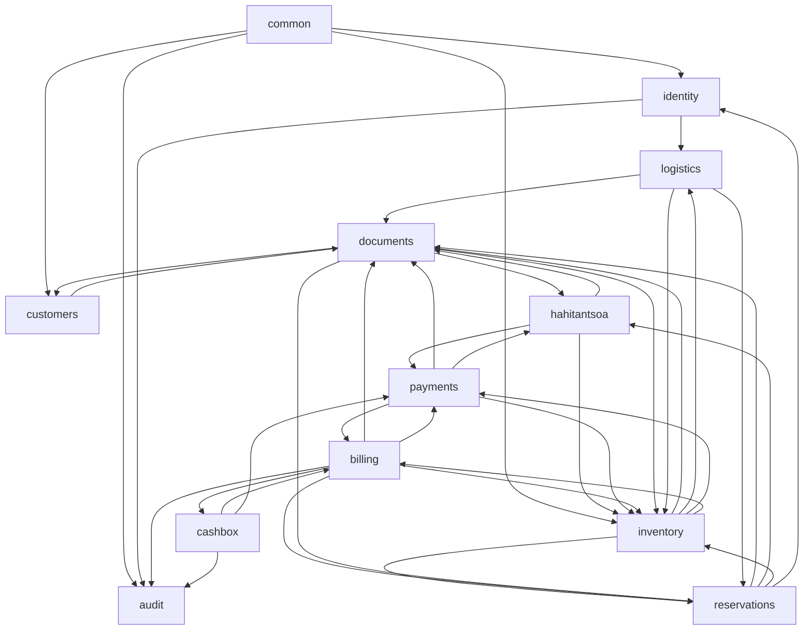

# BACKEND_MAP.md — Cartographie du backend

> **Version:** F176A — 2026-06-24
> **Référence gel backend:** F175A (HEAD `5d74979`)
> **Django:** 5.x, DRF, drf-spectacular
> **Base:** PostgreSQL 17, Redis 8

---

## 1. Architecture globale

```
┌─────────────────────────────────────────────────────────────────────┐
│                         Django Project                               │
│                    Hahitantsoa / Titan ERP                            │
├─────────────────────────────────────────────────────────────────────┤
│  config/                                                             │
│    ├── settings.py        ← INSTALLED_APPS, REST_FRAMEWORK, LOGGING │
│    ├── urls.py            ← Routage principal (14 includes)         │
│    ├── health.py          ← /healthz/, /readyz/                    │
│    ├── metrics.py         ← /metrics/ (Prometheus-style)            │
│    └── wsgi.py / asgi.py                                           │
├─────────────────────────────────────────────────────────────────────┤
│  apps/                                                               │
│    ├── common/           ← Modèles abstraits (UUID, timestamp, soft-delete, audit)
│    ├── audit/            ← Journal d'événements immuable            │
│    ├── identity/         ← RBAC : rôles + assignations             │
│    ├── customers/        ← Fichier client                          │
│    ├── inventory/        ← Articles, disponibilités, mouvements, retours, casse/perte
│    ├── reservations/     ← Brouillons Titan + confirmation + closeout│
│    ├── hahitantsoa/      ← Brouillons événement + confirmation     │
│    ├── documents/        ← Templates, instances, génération runtime, PDF
│    ├── payments/         ← Paiements, remboursements, passerelle    │
│    ├── billing/          ← Factures, échéanciers, avoirs, numérotation
│    ├── cashbox/          ← Sessions et mouvements de caisse        │
│    └── logistics/        ← Événements logistiques, passation, BL  │
└─────────────────────────────────────────────────────────────────────┘
```

---

## 2. Django Apps — détail

### 2.1 `common` — Couche fondation

| Élément | Détail |
|---|---|
| **Modèles** | `UUIDModel`, `TimestampedModel`, `SoftDeleteModel`, `AuditableModel` |
| **Usage** | Hérité par presque tous les modèles concrets du projet |
| **Tests** | `test_common_abstract_models.py`, `test_common_app_config.py` |

### 2.2 `audit` — Journal d'audit

| Élément | Détail |
|---|---|
| **Modèle** | `AuditEvent` — `actor`, `action`, `target_type`, `target_id`, `metadata` |
| **Service** | `record_audit_event_on_commit()` — enveloppe `transaction.on_commit()` |
| **Selectors** | `audit_events_queryset()`, `filter_audit_events(...)` |
| **Endpoints** | `GET /api/v1/audit/events/`, `GET /api/v1/audit/events/{id}/` |
| **Permissions** | `HasReservationSensitiveAccess` |
| **Tests** | `test_audit_api.py`, `test_audit_transaction_safety.py` |
| **Dépendances** | `common`, `identity` |

### 2.3 `identity` — RBAC

| Élément | Détail |
|---|---|
| **Modèles** | `ApplicationRole` (`name`, `slug`, `is_system_managed`), `UserRoleAssignment` |
| **Services** | `sync_system_roles()`, `assign_role()`, `revoke_role()` |
| **Selectors** | `active_roles`, `user_active_assignments`, `user_has_application_role` |
| **Endpoints** | `GET/POST /api/v1/identity/roles/`, `GET/PUT/PATCH/DELETE /api/v1/identity/roles/{id}/`, `GET /api/v1/identity/assignments/`, `POST /api/v1/identity/assignments/assign/`, `POST /api/v1/identity/assignments/{id}/revoke/`, `POST /api/v1/identity/roles/sync-system/` |
| **Permissions** | `HasReservationSensitiveAccess` (exportée globalement) |
| **Tests** | `test_identity_api.py`, `test_identity_app_config.py`, `test_identity_authorization.py`, `test_identity_models.py`, `test_identity_selectors.py`, `test_identity_services.py` |
| **Dépendances** | `common` |

### 2.4 `customers` — Fichier client

| Élément | Détail |
|---|---|
| **Modèle** | `Customer` — `display_name`, `email`, `phone`, `address`, `notes`, soft-delete |
| **Serializer** | `CustomerSerializer` |
| **Endpoints** | `GET /api/v1/customers/`, `GET /api/v1/customers/{id}/`, `POST /api/v1/customers/create/`, `POST /api/v1/customers/{id}/update/`, `POST /api/v1/customers/{id}/delete/` |
| **Tests** | `test_customer_model.py`, `test_customer_readonly_api.py`, `test_customer_write_api.py` |
| **Dépendances** | `common` |

### 2.5 `inventory` — Inventaire (le plus gros app)

| Élément | Détail |
|---|---|
| **Modèles** | `InventoryItem`, `InventoryAvailability`, `InventoryStockMovement`, `InventoryReturnOperation` (+ lines), `InventoryDamageLossSettlement` (+ lines + execution + caution refund + excess receivable) |
| **Sérialiseurs** | `InventoryItemSerializer`, `InventoryStockMovementSerializer`, `InventoryReturnOperationSerializer`, `InventoryDamageLossSettlementSerializer`, `InventoryDamageLossSettlementExecutionSerializer`, etc. |
| **Endpoints** | `GET /api/v1/inventory/items/`, `GET /api/v1/inventory/items/{id}/`, `GET/POST /api/v1/inventory/stock-movements/`, `GET/POST /api/v1/inventory/return-operations/`, `POST /api/v1/inventory/return-operations/{id}/validate/`, `GET/POST /api/v1/inventory/damage-loss-settlements/`, `POST /api/v1/inventory/damage-loss-settlements/{id}/validate/`, `GET/POST /api/v1/inventory/damage-loss-settlement-executions/`, `POST /api/v1/inventory/damage-loss-settlement-executions/{id}/execute/`, `POST /api/v1/inventory/excess-receivables/{id}/generate-invoice/` |
| **Services** | `create_inventory_stock_movement`, `create_inventory_return_operation`, `validate_inventory_return_operation`, `create_inventory_damage_loss_settlement`, `validate_inventory_damage_loss_settlement`, `execute_inventory_damage_loss_settlement_execution`, `propose_damage_loss_classification_lines`, etc. |
| **Selectors** | `get_available_inventory_items_for_period`, `get_return_operation_classification_breakdown`, `get_event_operations_summary` |
| **Scope** | `InventoryItemKind`: `MATERIAL`, `ARTICLE`, `MATERIAL_PACK` ; assertion `assert_titan_allowed_item_kind` |
| **Tests** | 25+ fichiers : `test_inventory_app_config.py`, `test_inventory_availability_*.py`, `test_inventory_damage_loss_*.py`, `test_inventory_item_*.py`, `test_inventory_return_operation_*.py`, `test_inventory_stock_movement_*.py`, `test_inventory_titan_scope.py` |
| **Dépendances** | `common`, `audit`, `documents`, `logistics`, `payments`, `reservations`, `billing` |

### 2.6 `reservations` — Brouillons Titan + confirmation + closeout

| Élément | Détail |
|---|---|
| **Modèles** | `ReservationDraft` (`customer`, `public_reference`, `status`, `contract_signed_at`, `required_deposit_received_at`, `confirmed_at`, `cancelled_at`), `ReservationDraftLine` |
| **Sérialiseurs** | `ReservationDraftSerializer`, `ReservationDraftLineSerializer`, `ReservationAvailabilitySummarySerializer`, etc. |
| **Endpoints** | `GET /api/v1/reservations/availability-summary/`, `GET /api/v1/reservations/available-item-previews/`, `GET /api/v1/reservations/items/{id}/availability-preview/`, `GET/POST /api/v1/reservations/drafts/`, `GET/PUT/PATCH /api/v1/reservations/drafts/{id}/`, `POST /api/v1/reservations/drafts/{id}/confirm/`, `POST /api/v1/reservations/drafts/{id}/cancel/`, `POST /api/v1/reservations/drafts/{id}/contract-signed/`, `POST /api/v1/reservations/drafts/{id}/required-deposit-received/`, `GET /api/v1/reservations/drafts/{id}/closeout/`, `POST /api/v1/reservations/drafts/{id}/closeout/execute/` |
| **Services** | `preview_reservation_item_service`, `get_reservation_available_items_options_service`, `get_reservation_draft_confirmation_preflight_service` |
| **Modules spéciaux** | `confirmation.py` — logique transactionnelle avec `select_for_update` ; `closeout.py` — résumé et exécution de clôture |
| **Tests** | 18+ fichiers : `test_reservation_draft_api.py`, `test_reservations_confirmation*.py`, `test_reservations_closeout*.py`, `test_reservations_availability*.py`, `test_reservations_scope.py`, etc. |
| **Dépendances** | `common`, `audit`, `customers`, `inventory`, `identity` |

### 2.7 `hahitantsoa` — Brouillons événement

| Élément | Détail |
|---|---|
| **Modèles** | `HahitantsoaEventDraft`, `HahitantsoaEventDraftLine`, `HahitantsoaEventDraftAmendmentRequest` (+ lines) |
| **Endpoints** | `GET /api/v1/hahitantsoa/discovery-items/`, `GET /api/v1/hahitantsoa/shared-availability/`, `GET/POST /api/v1/hahitantsoa/event-drafts/`, `GET/PUT/PATCH/DELETE /api/v1/hahitantsoa/event-drafts/{id}/`, `GET /api/v1/hahitantsoa/event-drafts/{id}/availability-preview/`, `GET /api/v1/hahitantsoa/event-drafts/{id}/confirmation-preflight/`, `POST /api/v1/hahitantsoa/event-drafts/{id}/confirm/`, `GET/POST /api/v1/hahitantsoa/event-drafts/{id}/amendment-requests/`, `GET/PUT/PATCH .../amendment-requests/{id}/`, `GET/POST .../amendment-requests/{id}/lines/`, `GET/PUT/PATCH/DELETE .../lines/{id}/`, `GET .../amendment-requests/{id}/availability-preflight/`, `GET/POST .../event-drafts/{id}/documents/`, `GET/POST .../documents/{id}/generate/` |
| **Services** | `confirm_hahitantsoa_event_draft`, `get_hahitantsoa_event_draft_confirmation_preflight`, `get_hahitantsoa_event_draft_amendment_preflight`, `create_hahitantsoa_event_draft_amendment_request`, etc. |
| **Tests** | 8 fichiers : `test_hahitantsoa_confirmation.py`, `test_hahitantsoa_discovery*.py`, `test_hahitantsoa_event_draft_api.py`, `test_hahitantsoa_scope.py`, etc. |
| **Dépendances** | `common`, `audit`, `customers`, `inventory`, `documents`, `payments`, `reservations` |

### 2.8 `documents` — Templates, instances, runtime, PDF

| Élément | Détail |
|---|---|
| **Modèle** | `DocumentInstance` — `reservation_draft`, `hahitantsoa_event_draft`, `customer`, `template_key`, `status` (`prepared` → `generated` → `voided`), `storage_path`, `pdf_storage_path` |
| **Services** | `create_document_instance_from_reservation_draft`, `create_document_instance_from_hahitantsoa_event_draft`, `generate_reservation_draft_document_instance_html`, `generate_document_instance_pdf`, etc. |
| **Selectors** | `list_document_instances_for_reservation_draft`, `list_active_document_instances_for_reservation_draft`, `list_document_instances_for_hahitantsoa_event_draft`, `get_document_instance_by_id` |
| **Endpoints** | `GET /api/v1/documents/templates/`, `GET /api/v1/documents/templates/{key}/`, `GET /api/v1/documents/titan/proforma-drafts/{id}/preview/`, `GET /api/v1/documents/instances/{id}/artifact/`, `GET/POST /api/v1/documents/reservation-drafts/{id}/instances/`, `GET .../instances/{id}/`, `POST .../instances/{id}/generate/`, `POST .../instances/{id}/generate-pdf/`, `GET .../instances/{id}/pdf/` |
| **Tests** | 10 fichiers : `test_documents_commercial_context.py`, `test_documents_document_instance_foundation.py`, `test_documents_pdf_generation.py`, `test_documents_runtime_generation.py`, etc. |
| **Dépendances** | `common`, `audit`, `customers`, `reservations`, `hahitantsoa`, `inventory` |

### 2.9 `payments` — Paiements et passerelle

| Élément | Détail |
|---|---|
| **Modèle** | `Payment` — `reservation_draft`, `hahitantsoa_event_draft`, `receipt_document`, `refund_obligation`, `billing_refund_obligation`, `payment_kind`, `payment_method`, `payment_status` |
| **Sérialiseurs** | `PaymentSerializer`, `PaymentCreateSerializer`, `PaymentConfirmSerializer`, `RefundPaymentCreateSerializer` |
| **Endpoints** | `GET/POST /api/v1/payments/`, `GET /api/v1/payments/{id}/`, `POST /api/v1/payments/{id}/confirm/`, `POST /api/v1/payments/{id}/cancel/`, `POST /api/v1/payments/{id}/reconcile/`, `POST /api/v1/payments/refund/`, `POST /api/v1/payments/{id}/refund-confirm/`, `POST /api/v1/payments/gateway/initiate/{draft_id}/`, `POST /api/v1/payments/gateway/callback/` |
| **Services** | `create_payment`, `confirm_payment`, `cancel_payment`, `reconcile_payment`, `create_refund_payment`, `confirm_refund_payment`, `initiate_mobile_money_payment`, `process_gateway_callback` |
| **Tests** | 8 fichiers : `test_payments_api.py`, `test_payments_gateway.py`, `test_payments_refund.py`, `test_payments_services.py`, etc. |
| **Dépendances** | `common`, `audit`, `billing`, `documents`, `hahitantsoa`, `inventory`, `reservations` |

### 2.10 `billing` — Facturation (app le plus dense en lignes de service)

| Élément | Détail |
|---|---|
| **Modèles** | `BillingInvoice` (519 lignes de modèle incluant relations), `BillingInvoiceNumberingPolicy`, `BillingInvoiceSettlement`, `BillingInvoiceInstallment`, `BillingInstallmentAllocation`, `BillingRefundObligation`, `BillingCreditNote` |
| **Sérialiseurs** | `BillingInvoiceSerializer`, `BillingInvoiceSettleSerializer`, `BillingInvoiceInstallmentSerializer`, `BillingInstallmentScheduleCreateSerializer`, `BillingInstallmentAllocateSerializer`, `BillingInvoiceCorrectSerializer`, `BillingRefundObligationSerializer`, `BillingRefundObligationExecuteSerializer`, `BillingCreditNoteSerializer`, `BillingCreditNoteIssueSerializer` |
| **Endpoints** | `GET /api/v1/billing/invoices/`, `GET /api/v1/billing/invoices/{id}/`, `POST /api/v1/billing/invoices/{id}/settle/`, `POST /api/v1/billing/invoices/{id}/cancel/`, `POST /api/v1/billing/invoices/{id}/installments/`, `POST /api/v1/billing/installments/{id}/allocate/`, `POST /api/v1/billing/invoices/{id}/correct/`, `POST /api/v1/billing/refund-obligations/{id}/execute/`, `GET/POST /api/v1/billing/invoices/{id}/credit-notes/`, `GET /api/v1/billing/invoices/{id}/credit-notes/{cn_id}/`, `POST /api/v1/billing/invoices/{id}/credit-notes/{cn_id}/cancel/` |
| **Services** (~1300 lignes) | `settle_billing_invoice`, `cancel_billing_invoice`, `create_billing_invoice_installments`, `allocate_payment_to_installment`, `create_billing_invoice_refund_obligation`, `execute_billing_refund_obligation`, `issue_billing_invoice_for_excess_receivable`, `issue_billing_invoice_for_commercial_closeout`, `assign_invoice_number`, `compute_reservation_financial_closeout_summary`, `issue_credit_note`, `cancel_credit_note` |
| **Tests** | 10 fichiers : `test_billing_api.py`, `test_billing_credit_notes.py`, `test_billing_installment_*.py`, `test_billing_numbering.py`, `test_billing_refund_obligation.py`, `test_billing_services.py`, etc. |
| **Dépendances** | `common`, `audit`, `documents`, `inventory`, `payments`, `reservations`, `cashbox` |

### 2.11 `cashbox` — Caisse

| Élément | Détail |
|---|---|
| **Modèles** | `CashboxSession` (`operator`, `opened_at`, `closed_at`), `CashboxMovement` (`session`, `direction`, `amount`, `payment`, `billing_invoice`, `billing_refund_obligation`) |
| **Endpoints** | `GET /api/v1/cashbox/sessions/`, `GET /api/v1/cashbox/sessions/{id}/`, `POST /api/v1/cashbox/sessions/open/`, `POST /api/v1/cashbox/sessions/{id}/close/`, `GET /api/v1/cashbox/movements/`, `POST /api/v1/cashbox/sessions/{id}/movements/` |
| **Services** | `open_cashbox_session`, `close_cashbox_session`, `record_cashbox_movement`, `compute_cashbox_session_net_amount` |
| **Tests** | `test_cashbox_api.py`, `test_cashbox_services.py` |
| **Dépendances** | `common`, `audit`, `billing`, `payments` |

### 2.12 `logistics` — Logistique

| Élément | Détail |
|---|---|
| **Modèles** | `LogisticsEvent` (`reservation_draft`, `event_type`, `status`, `scheduled_at`, `executed_at`, `signature_required`, `signature_received`), `LogisticsEventItemLine` |
| **Endpoints** | `GET /api/v1/logistics/events/`, `GET /api/v1/logistics/events/{id}/`, `POST /api/v1/logistics/events/create/`, `POST /api/v1/logistics/events/{id}/update/`, `POST /api/v1/logistics/events/{id}/transition/`, `GET /api/v1/logistics/events/{id}/lines/`, `POST /api/v1/logistics/events/{id}/lines/add/`, `POST /api/v1/logistics/events/{id}/lines/{line_id}/remove/`, `POST /api/v1/logistics/events/{id}/complete-passation/` |
| **Services** | `create_logistics_event`, `update_logistics_event`, `transition_logistics_event_status`, `add_item_line_to_logistics_event`, `remove_item_line_from_logistics_event`, `complete_handover_passation`, `create_delivery_note_from_handover_event` |
| **Selectors** | `active_logistics_events`, `logistics_events_for_reservation_draft`, `get_logistics_event_item_lines` |
| **Tests** | 4 fichiers : `test_logistics_api.py`, `test_logistics_models.py`, `test_logistics_operations_consolidation.py`, `test_logistics_services.py` |
| **Dépendances** | `common`, `audit`, `documents`, `inventory`, `reservations`, `identity` |

---

## 3. Tableau récapitulatif des apps

| App | Models (lignes) | Services (lignes) | Views (lignes) | Tests | Statut gel |
|---|---|---:|---:|---:|---|
| `audit` | 1 | ~30 | ~60 | 2 | Gel — maintenance autorisée |
| `billing` | 519 | ~1300 | ~440 | 10 | Gel — maintenance autorisée |
| `cashbox` | 172 | ~216 | ~161 | 2 | Gel — maintenance autorisée |
| `common` | 4 (abstraits) | — | — | 2 | Gel — maintenance autorisée |
| `customers` | 25 | — | ~118 | 3 | Gel — maintenance autorisée |
| `documents` | 124 | ~374 | ~284 | 10 | Gel — maintenance autorisée |
| `hahitantsoa` | 281 | ~794 | ~653 | 8 | Gel — maintenance autorisée |
| `identity` | ~80 | ~150 | ~200 | 7 | Gel — maintenance autorisée |
| `inventory` | 867 | ~971 | ~483 | 25+ | Gel — maintenance autorisée |
| `logistics` | ~80 | ~200 | ~220 | 4 | Gel — maintenance autorisée |
| `payments` | 281 | ~511 | ~244 | 8 | Gel — maintenance autorisée |
| `reservations` | 182 | ~130 | ~298 | 18+ | Gel — maintenance autorisée |

---

## 4. Dépendances inter-apps



**Remarque :** Ce graphe est une simplification. Les dépendances réelles sont plus granulaires (sélecteurs/services importés unitairement).

---

## 5. Frontières read/write

| App | Lectures (selectors) | Écritures (services) |
|---|---|---|
| `audit` | `audit_events_queryset` | `record_audit_event_on_commit` (uniquement via `on_commit`) |
| `billing` | `compute_reservation_financial_closeout_summary` | `settle_billing_invoice`, `cancel_billing_invoice`, `issue_credit_note`, `execute_billing_refund_obligation` |
| `cashbox` | `compute_cashbox_session_net_amount` | `open_cashbox_session`, `close_cashbox_session`, `record_cashbox_movement` |
| `customers` | `CustomerSerializer` (list/retrieve) | `createCustomer`, `updateCustomer`, `deleteCustomer` (views inline) |
| `documents` | `list_document_instances_for_reservation_draft` | `create_document_instance_from_reservation_draft`, `generate_document_instance_pdf` |
| `hahitantsoa` | `list_hahitantsoa_discovery_items` | `confirm_hahitantsoa_event_draft`, `create_hahitantsoa_event_draft_amendment_request` |
| `identity` | `active_roles`, `user_active_assignments` | `assign_role`, `revoke_role`, `sync_system_roles` |
| `inventory` | `get_available_inventory_items_for_period` | `create_inventory_stock_movement`, `validate_inventory_return_operation`, `execute_inventory_damage_loss_settlement_execution` |
| `logistics` | `active_logistics_events`, `logistics_events_for_reservation_draft` | `create_logistics_event`, `complete_handover_passation`, `transition_logistics_event_status` |
| `payments` | `PaymentSerializer` (list/retrieve) | `create_payment`, `confirm_payment`, `cancel_payment`, `initiate_mobile_money_payment` |
| `reservations` | `get_reservation_available_items_options_service` | `confirm_reservation_draft` (dans `confirmation.py`), `closeout_reservation_draft` |

---

## 6. Invariants critiques

| Invariant | App | Evidence | Agent type |
|---|---|---|---|
| `select_for_update` sur `InventoryAvailability` lors de la confirmation | reservations, hahitantsoa | `confirmation.py`, `test_reservations_confirmation.py` | backend-maintenance |
| `transaction.on_commit` pour les effets de succès (audit, paiement) | audit, payments, billing | `record_audit_event_on_commit`, `confirm_payment` | backend-maintenance |
| `assert_titan_allowed_item_kind` refuse local/service | inventory | `test_inventory_titan_scope.py` | backend-maintenance |
| Un proforma n'est jamais une confirmation | reservations | `test_reservations_confirmation_preflight.py` | backend-maintenance |
| Un contrat signé est immuable ; modifications via avenant | reservations, hahitantsoa | `DEC-001`, `test_hahitantsoa_event_draft_api.py` | backend-maintenance |
| Soft-delete uniquement via `is_deleted` / `deleted_at` | customers, inventory, reservations | `SoftDeleteModel` | backend-maintenance |
| Attribution durable (`created_by`, `updated_by`, `confirmed_by`) | common | `AuditableModel` | backend-maintenance |

---

## 7. Règles de propriété backend pour agents (post-gel)

Après F175A, le backend est gelé fonctionnellement. Voici ce qui est encore autorisé :

| Action | Autorisé ? | Conditions |
|---|---|---|
| Correction de bug | ✅ Oui | PR dédiée, tests ciblés |
| Maintenance tests | ✅ Oui | Sans modification de modèle |
| Mise à jour documentation backend | ✅ Oui | Sans modification de code métier |
| Refactoring mineur | ⚠️ Sous réserve | Pas de changement de comportement visible |
| Nouvelle feature | ❌ Non | Autorisation humaine explicite requise |
| Nouveau modèle / migration | ❌ Non | Autorisation humaine explicite requise |
| Nouvel endpoint API | ❌ Non | Autorisation humaine explicite requise |

---
*Fin de la cartographie backend*
