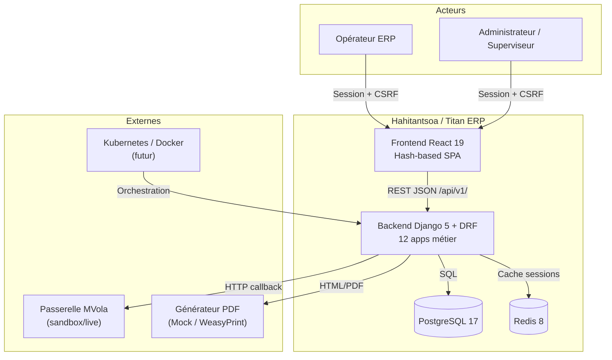
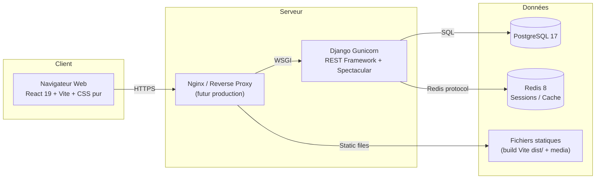
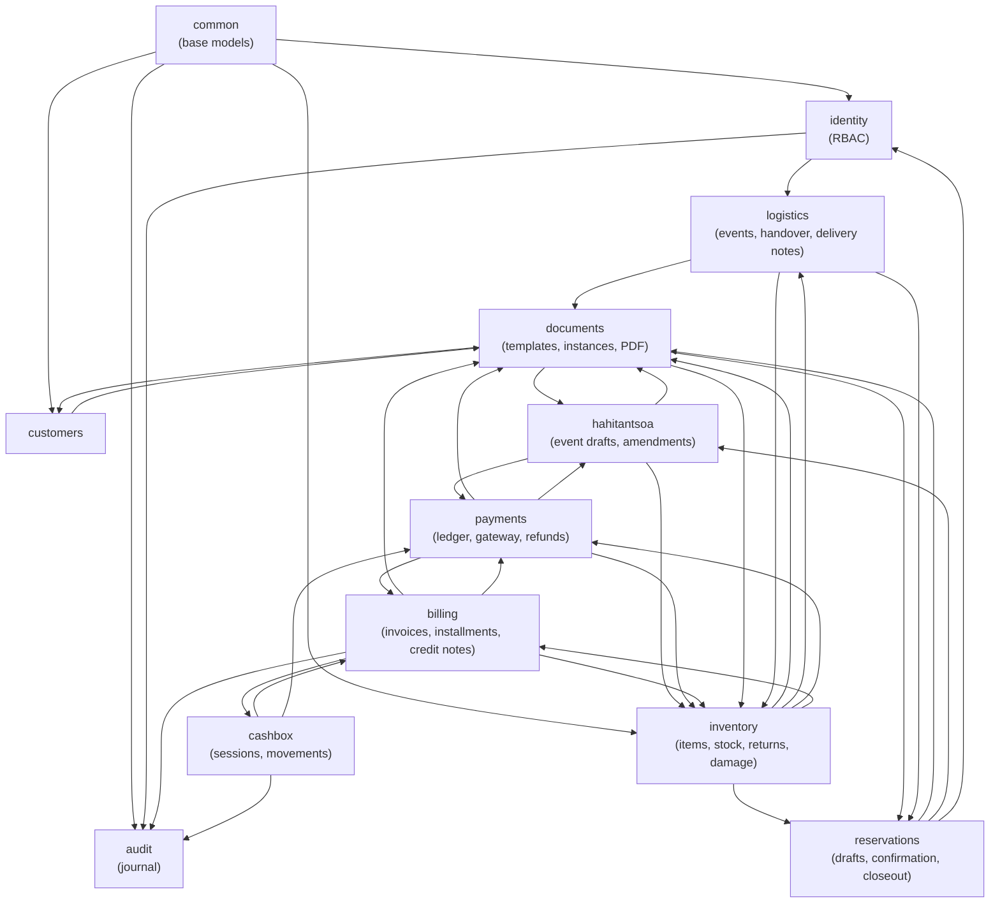
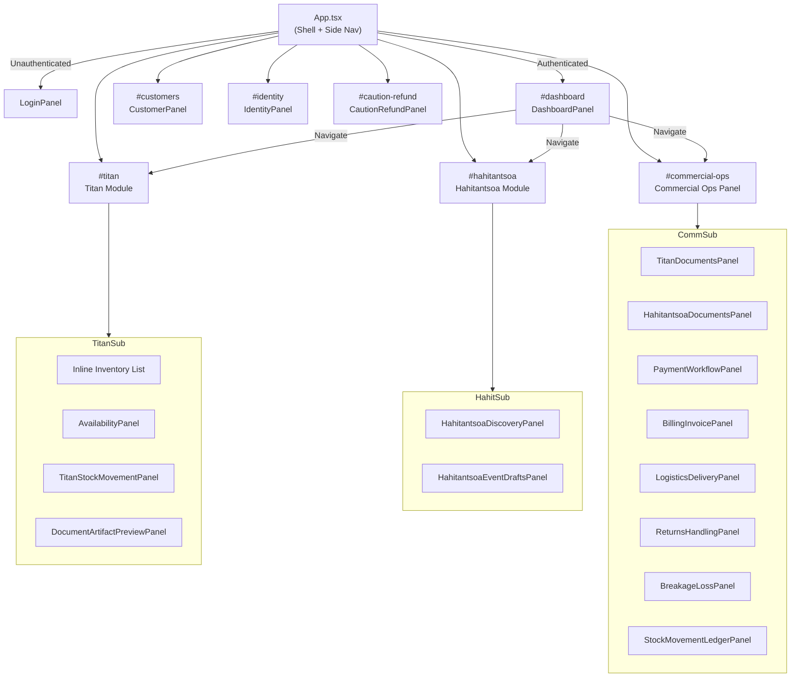
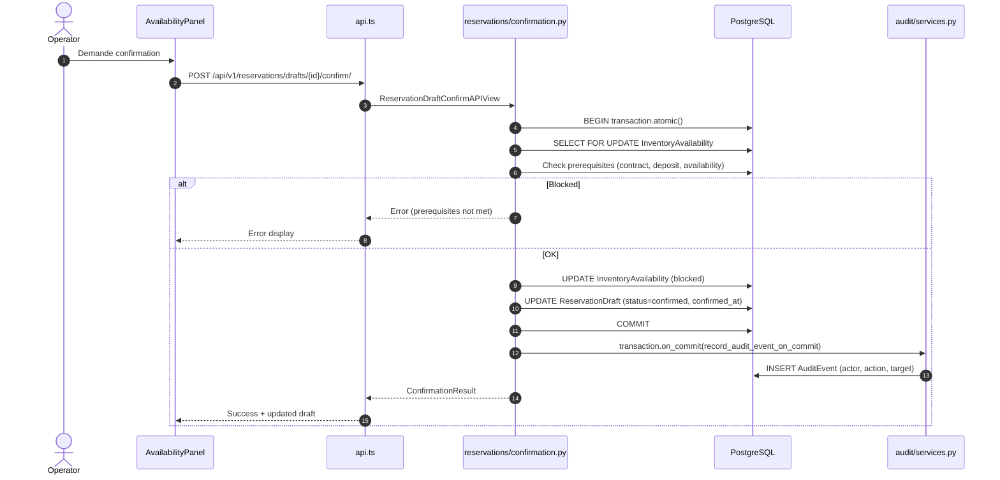
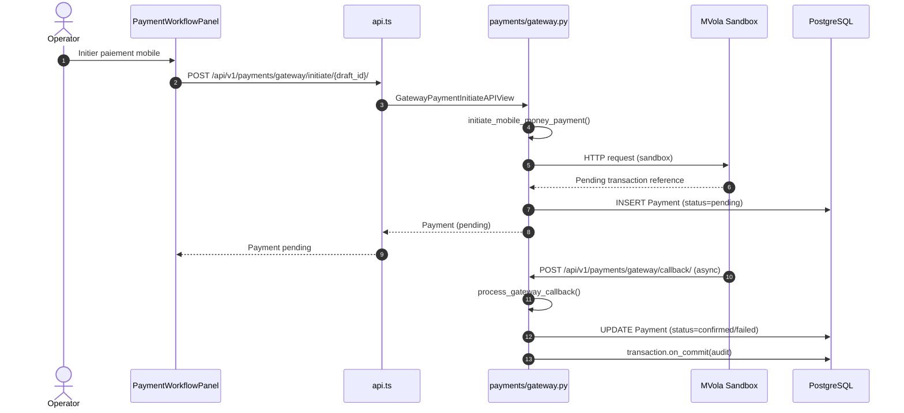
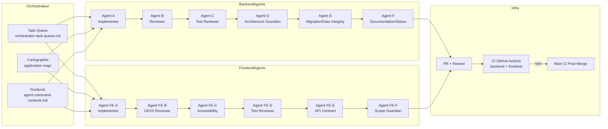
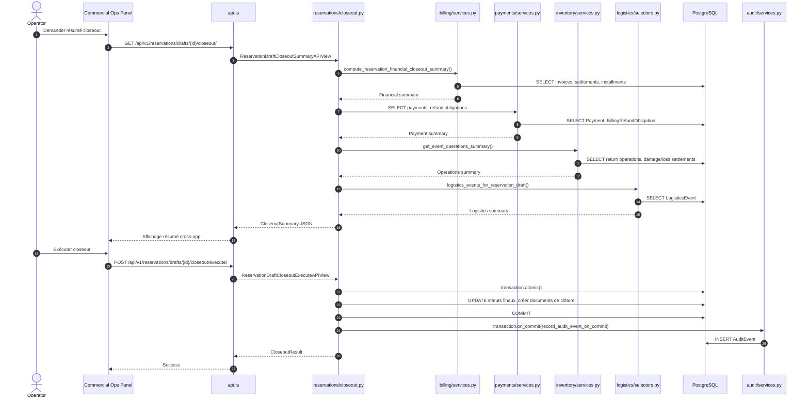
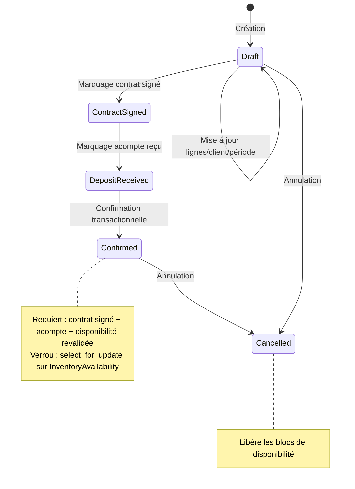
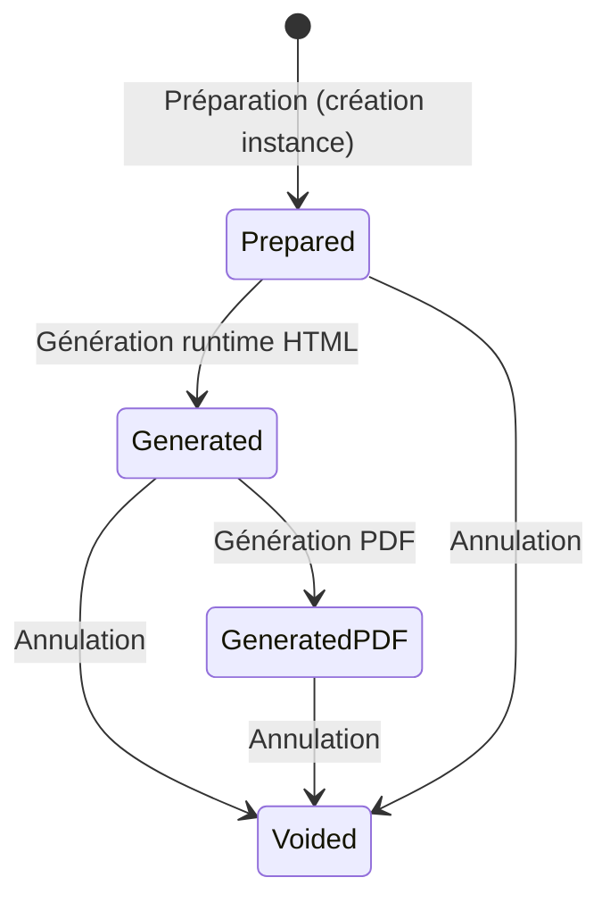

# DIAGRAMS.md — Diagrammes Mermaid

> **Version:** F176A — 2026-06-24
> **Usage:** Références visuelles pour l'architecture, les flux et la navigation

---

## 1. Diagramme de contexte C4-like

---

## 2. Diagramme des conteneurs

---

## 3. Graphe de dépendance des modules backend

---

## 4. Graphe de navigation frontend

---

## 5. Diagramme de séquence — Confirmation transactionnelle (Titan)

---

## 6. Diagramme de séquence — Passerelle paiement MVola

---

## 7. Diagramme agent — Workflow multi-agent

---

## 8. Diagramme de séquence — Flux de clôture commercial (closeout)

---

## 9. Diagramme d'état — Réservation Titan

---

## 10. Diagramme d'état — Instance de document

---
*Fin des diagrammes*
